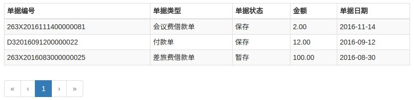

# SSC-Grid [![Travis][build-badge]][build] [![AppVeyor][appveyor-badge]][appveyor] [![npm][npm-badge]][npm] [![Codecov][codecov-badge]][codecov]

SSC 3.0 Grid组件



## 使用

```bash
npm install ssc-grid --save
```

```jsx
import { Grid } from 'ssc-grid';
...
render() {
  const mockColumnsModel = [
    {type: 'string', id: 'danjubianhao', label: '单据编号'},
    {type: 'string', id: 'danjuleixing', label: '单据类型'},
    {type: 'string', id: 'danjuzhuangtai', label: '单据状态'},
    {type: 'double', id: 'jine', label: '金额'},
    {type: 'date', id: 'danjuriqi', label: '单据日期'}
  ];
  const mockTableData = [{
    danjubianhao: '263X2016111400000081',
    danjuleixing: '会议费借款单',
    danjuzhuangtai: '保存',
    jine: '2.00',
    danjuriqi: '2016-11-14'
  }, {
    danjubianhao: 'D32016091200000022',
    danjuleixing: '付款单',
    danjuzhuangtai: '保存',
    jine: '12.00',
    danjuriqi: '2016-09-12'
  }, {
    danjubianhao: '263X2016083000000025',
    danjuleixing: '差旅费借款单',
    danjuzhuangtai: '暂存',
    jine: '100.00',
    danjuriqi: '2016-08-30'
  }];

  return (
    <Grid columnsModel={mockColumnsModel} tableData={mockTableData} />
  );
}
```

## 文档

[API文档][documentation]中带有示例代码，并且可以在线编辑并运行代码。

[documentation]: https://ssc-grid.github.io
[contributing]: CONTRIBUTING.md

[build-badge]: https://travis-ci.org/yyssc/ssc-grid.svg?branch=master
[build]: https://travis-ci.org/yyssc/ssc-grid

[npm-badge]: https://badge.fury.io/js/ssc-grid.svg
[npm]: http://badge.fury.io/js/ssc-grid

[codecov-badge]: https://img.shields.io/codecov/c/github/yyssc/ssc-grid/master.svg
[codecov]: https://codecov.io/gh/yyssc/ssc-grid

[appveyor-badge]: https://img.shields.io/appveyor/ci/yyssc/ssc-grid/master.svg
[appveyor]: https://ci.appveyor.com/project/yyssc/ssc-grid
